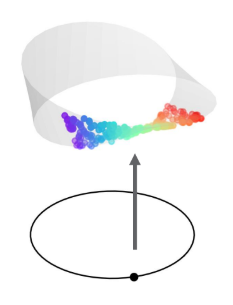
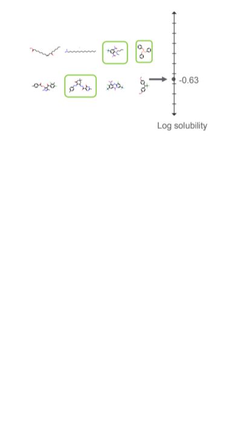

 

<!-- I maintain a [Google Scholar](https://scholar.google.com/citations?user=Rt5hMwUAAAAJ&hl=en) with my papers and preprints. Below are some highlighted projects. -->

## Recent Work

My primary research interests are in theoretical foundations and methods for unsupervised machine learning, particularly clustering and embedding.

  

- "Cluster and then Embed: A Modular Approach for Visualization". **E. Coda**, E. Arias-Castro, and G. Mishne. *arXiv* (2025). [`[preprint]`](https://arxiv.org/pdf/2509.03373) [`[code]`](https://github.com/lizzycoda/cluster_embed)

- "An Axiomatic Definition of Hierarchical Clustering". E. Arias-Castro and **E. Coda**. *Journal of Machine Learning Research* (2025). [`[paper]`](https://www.jmlr.org/papers/volume26/24-1052/24-1052.pdf) [`[article]`](https://today.ucsd.edu/story/new-mathematical-framework-better-illustrates-complex-data-patterns)

- "Graph Max Shift: A Hill-Climbing Method for Graph Clustering". E. Arias-Castro, **E. Coda**, and W. Qiao. *arXiv* (2024). [`[preprint]`](https://arxiv.org/pdf/2411.18794) [`[code]`](https://github.com/lizzycoda/GraphMaxShift)

[Here](files/candidacy_slides.pdf) are my slides from my advancement to candidacy in December 2024, which focused on clustering from a statistical perspective.

<!-- ### Embedding and Dimensionality Reduction -->

<!-- 
 -->
<!--    -->
<!-- 
 -->

<!-- 
 -->

<!-- - "Cluster and then Embed: A Modular Approach for Visualization". **E. Coda**, E. Arias-Castro, and G. Mishne. *arXiv* (2025). [`[preprint]`](https://arxiv.org/pdf/2509.03373) [`[code]`](https://github.com/lizzycoda/cluster_embed) -->

<!-- 
 -->

<!-- 

 -->

 

## Previous Work

Prior to UCSD, I was a data scientist at Pacific Northwest National Laboratory where I broadly worked on deep learning problems with applications including computer vision, materials science, molecular property prediction, and radio frequency data. 

### Robust Deep Learning

  

- "Probing the Limits of Mathematical World Models in LLMs". H. Kvinge, **E. Coda**, E. Yeats, D. Brown, J. Buckheit, et al. *ICML 2025 Workshop on Assessing World Models* (2025). [`[paper]`](https://openreview.net/pdf?id=aMaSHy8IgK)

- "Universal Fourier Attack for Time Series". **E. Coda**, B. Clymer, C. DeSmet, Y. Watkins, and M. Girard. *IEEE Open Journal of Signal Processing* (2024). [`[paper]`](https://ieeexplore.ieee.org/document/10557789)

### Topologically and Geometrically Informed Approaches to Machine Learning 

  

<!-- Neural network architectures informed by topological structures, to better model data  -->

- "Haldane Bundles: A Dataset for Learning to Predict the Chern Number of Line Bundles on the Torus". C. Tipton, **E. Coda**, D. Brown, A. Bittner, J. Lee, G. Jorgenson, T. Emerson, and H. Kvinge. *NeurIPS Workshop on Symmetry and Geometry in Neural Representations* (2023). [`[paper]`](https://openreview.net/attachment?id=gt9dDWc6GL&name=pdf) [`[code]`](https://github.com/shadtome/haldane-bundles)

- "Fiber Bundle Morphisms as a Framework for Modeling Many-to-Many Maps". **E. Coda**, N. Courts, C. Wight, L. Truong, W. Choi, C. Godfrey, T. Emerson, K. Kappagantula, and H. Kvinge. *Proceedings of Topological, Algebraic, and Geometric Learning Workshops 2022* (2022). [`[paper]`](https://proceedings.mlr.press/v196/coda22a/coda22a.pdf)

### Applications 

  

  - "Impacts of Data and Models on Unsupervised Pre-training for Molecular Property Prediction". **E. Coda**, G. Panapitiya, and E. Saldanha. *AI for Accelerated Materials Design-NeurIPS 2023 Workshop* (2023).[`[paper]`](https://openreview.net/pdf?id=Ztku4ig4xM) 

  - "Evaluating uncertainty-based active learning for accelerating the generalization of molecular property prediction". T. Yin, G. Panapitiya, **E. Coda**, and E. Saldanha. *Journal of Cheminformatics* (2023). [`[paper]`](https://link.springer.com/article/10.1186/s13321-023-00753-5)[`[code]`](https://github.com/pnnl/UQALE)

  - "Deep Learning for Spectral Filling in Radio Frequency Applications". M. Setzler, **E. Coda**, J. Rounds, M. Vann, and M. Girard. *2022 Sensor Signal Processing for Defence Conference* (2022). [`[paper]`](https://arxiv.org/pdf/2204.01536)

  - "Differential Property Prediction: A Machine Learning Approach to Experimental Design in Advanced Manufacturing". L. Truong, W. Choi, C. Wight, **E. Coda**, T. Emerson, K. Kappagantula, and H. Kvinge. *AAAI 2022 Workshop on AI for Design and Manufacturing* (2022). [`[paper]`](https://arxiv.org/pdf/2112.01687)

  - "CHOSEN: A synthesis of hydrometeorological data from 30 intensively monitored watersheds across the US". L. Zhang, E. Moges, J. Kirchner, **E. Coda**, T. Liu, A. Wymore, Z. Xu, L. Larsen. *Hydrological Processes* (2021). [`[paper]`](https://onlinelibrary.wiley.com/doi/abs/10.1002/hyp.14429) [`[code]`](https://gitlab.com/esdl/chosen)

